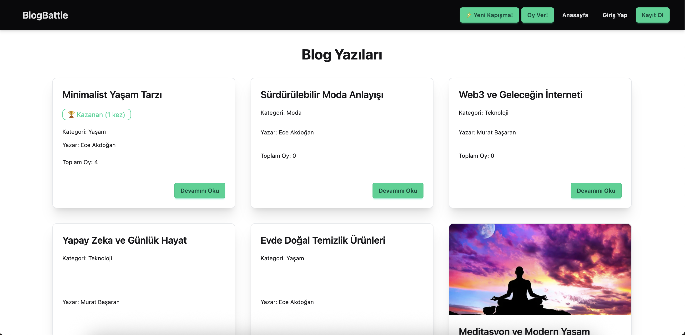
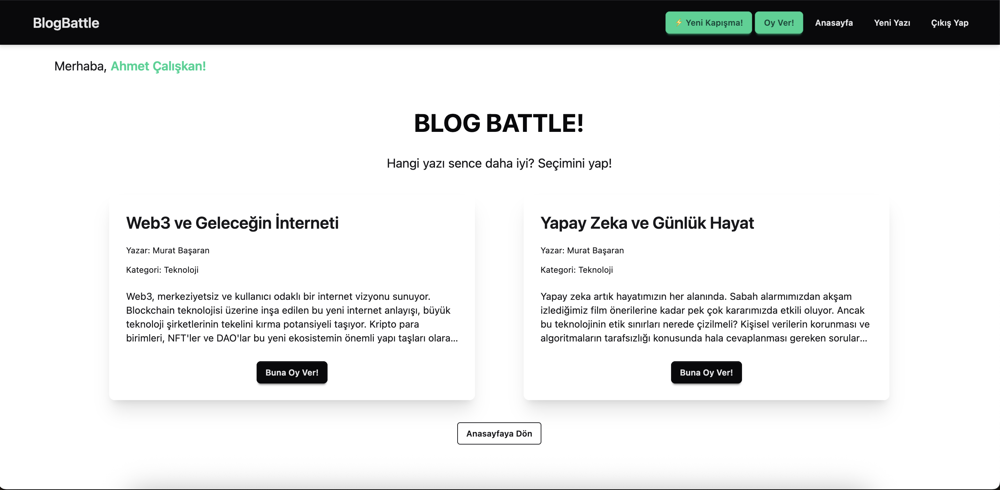

# Blog Battle 

The project is a platform where users can create blog posts, these posts compete by being matched randomly or by category, and winners are determined by user votes.

**GitHub Repo:** [https://github.com/elffba/blog-battle-project](https://github.com/elffba/blog-battle-project)

**Homepage Screenshot:**


**Voting Screen Screenshot:**


## Project Purpose and Core Features

* Users can register and log in (with JWT).
* Logged-in users can add (title, content, category, image), update, and delete blog posts.
* Visitors can read posts.
* Posts are matched randomly (or by category - *API support added, UI not available*) and appear on the "Battle" page.
* Logged-in users can vote between two posts in active matches (1 vote per match).
* Voting results are displayed as percentages after voting.
* The winning post in finished matches is determined and marked (with win count and a badge).
* Simplified tournament logic: The win count (`wins`) and round (`currentRound`) of winning posts are updated. Posts with lower rounds or win counts are prioritized in new matches (instead of fully automatic bracket progression).
* Basic leaderboard view (sorted by win count).
* Button on the interface to start a new match (for testing/demo purposes).
* **Responsive Design:** The application has a responsive design that adapts to different screen sizes.

## Used Technologies

### Backend:

* Node.js
* Express.js
* MongoDB 
* Mongoose (ODM)
* JSON Web Token (JWT) - For authentication
* Bcryptjs - For password hashing
* Multer - For file (image) uploading
* Cors - For Cross-Origin Resource Sharing
* Dotenv - For environment variables

### Frontend:

* React (with Vite)
* React Router DOM v6 - For page routing
* Redux Toolkit - For global state management
* Axios - For API requests
* Tailwind CSS v3 - For styling infrastructure
* DaisyUI - Tailwind CSS component library 

## Setup and Running

To run the project on your local machine, follow the steps below:

### Prerequisites

* Node.js (v18 or higher recommended)
* npm (comes with Node.js)
* MongoDB (Local installation or MongoDB Atlas account)
* Git

### Steps

1.  **Clone the Project:**
    ```bash
    git clone [https://github.com/elffba/blog-battle-project.git](https://github.com/elffba/blog-battle-project.git)
    cd blog-battle-project
    ```

2.  **Backend Setup:**
    * Navigate to the backend folder:
        ```bash
        cd backend
        ```
    * Install the necessary packages:
        ```bash
        npm install
        ```
    * Create the `.env` File: In the root directory of the `backend` folder, create a file named `.env` and fill in the following variables with your own information:
        ```dotenv
        NODE_ENV=development
        PORT=5001 # Port for the backend server (must be different from the frontend)
        MONGO_URI=mongodb+srv://YOUR_USERNAME:<YOUR_PASSWORD>@YOUR_CLUSTER_NAME.mongodb.net/blogBattleDb?retryWrites=true&w=majority # Your MongoDB connection string
        JWT_SECRET=averysecretjsonwebtokenkeygeneratethis # Generate a secure JWT secret key
        ```
        * **Note:** Use your own MongoDB Atlas connection string or local MongoDB address for `MONGO_URI`. You can use a different database name instead of `blogBattleDb`.
    * Start the backend server in development mode:
        ```bash
        npm run dev
        ```
        The server will run by default at `http://localhost:5001`.

3.  **Frontend Setup:**
    * **Open a new terminal** (the backend server should continue running).
    * From the project's root directory, navigate to the `frontend` folder:
        ```bash
        cd ../frontend
        # Or if you are in the project root directory: cd frontend
        ```
    * Install the necessary packages:
        ```bash
        npm install
        ```
    * Start the frontend application in development mode:
        ```bash
        npm run dev
        ```
        The application will usually open at `http://localhost:5173` (check the address in the terminal).

4.  **Using the Application:**
    * Open the frontend address (`http://localhost:5173`) in your browser.
    * Register with a new account or log in with an existing one.
    * Create posts, go to the voting page, and vote!
    * You can use the "Start New Battle!" button on the homepage to initiate new matches.

## API Endpoints (Summary)

This project provides the following core API endpoints:

### Auth (Authentication)

* `POST /api/auth/register`: Registers a new user.
* `POST /api/auth/login`: Logs in a user and returns a JWT (JSON Web Token).

### Posts

* `GET /api/posts`: Lists all blog posts in the system.
* `POST /api/posts`: Creates a new blog post. **(Token Required, FormData)**
* `GET /api/posts/:id`: Retrieves the details of a blog post with a specific ID.
* `PUT /api/posts/:id`: Updates a blog post with a specific ID. **(Token Required, Author Check, FormData)**
* `DELETE /api/posts/:id`: Deletes a blog post with a specific ID. **(Token Required, Author Check)**

### Matches

* `POST /api/matches/start`: Starts a new active match. **(Optionally, category can be specified in the body with `{ "category": "..." }`)**
* `GET /api/matches/active`: Retrieves a random active match for voting.
* `POST /api/matches/:matchId/vote`: Casts a vote for a specific match. **(Token Required, Body: `{ "votedForPostId": "..." }`)**
* `POST /api/matches/:matchId/finish`: Finishes an active match and determines the winner. **(Token Required)**

**Note:** These API endpoints have been tested using Insomnia.

## Known Limitations and Potential Improvements

* **Tournament Logic:** The system currently uses a simple progression logic based on win count and random matching (among eligible posts) rather than automatically advancing a full bracket structure. Winners advance to the next round (`currentRound` is updated) and losers are marked, but matches may not always be strictly between winners of the same round (simplified `startNewMatch` logic).
* **Match Initiation:** New matches are currently only triggered manually via the button on the homepage. An automatic matching system has not been implemented.
* **Notifications:** A feature to send notifications to authors whose posts are up for voting has not been added.
* **Real-time Updates:** Voting results are updated after voting or when the page is refreshed; there are no instant updates with WebSockets.
* **UI/UX:** The interface is functional, but animations (voting transitions), detailed responsive tests, and more advanced user feedback (e.g., toast notifications) could be added.
* **Category-Based Matching:** Although the backend supports category-based matching, the frontend does not have an interface for selecting a category to start a match.
